
<a href="https://aufanhakim1920-source.github.io/studio/"></a>

Every project is a take. Open one.

<b>TAKE 01</b> &nbsp;·&nbsp; <b>Week Board</b> &nbsp;<code>LIVE</code>&nbsp; a booking page that reads my real calendar

 
<a href="https://stellular-queijadas-097900.netlify.app">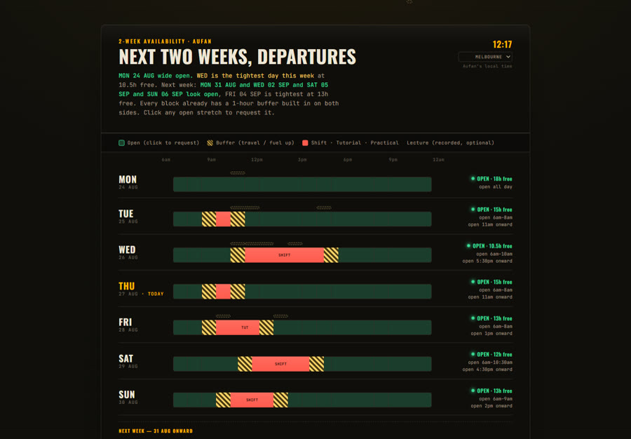</a>
 Netlify · Google Calendar · <a href="https://stellular-queijadas-097900.netlify.app">open it ↗</a>

<b>TAKE 02</b> &nbsp;·&nbsp; <b>Biomate</b> &nbsp;<code>LIVE</code>&nbsp; swipe a hike, join the group, record the walk

 
<a href="https://aufanhakim1920-source.github.io/biomate/">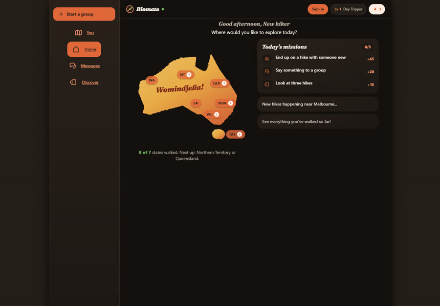</a>
 Hackathon, uni team · Postgres with row-level security · <a href="https://aufanhakim1920-source.github.io/biomate/">open it ↗</a> · <a href="https://github.com/aufanhakim1920-source/biomate">code</a>

<b>TAKE 03</b> &nbsp;·&nbsp; <b>baka nae.</b> &nbsp; a brand site for my sister's art label

 
<a href="https://aufanhakim1920-source.github.io/studio/work/bakanae-atelier/">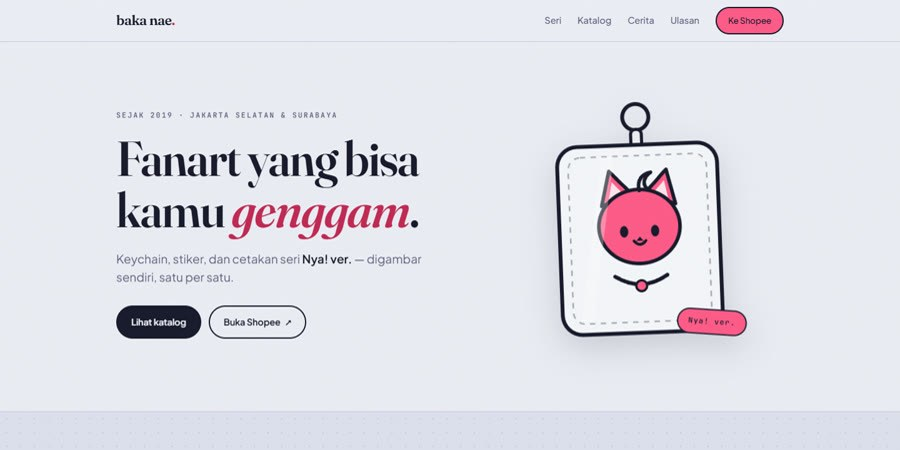</a>
 For family, unpaid — the shop is hers · <a href="https://aufanhakim1920-source.github.io/studio/work/bakanae-atelier/">open it ↗</a>

<b>TAKE 04</b> &nbsp;·&nbsp; <b>Retail Ops</b> &nbsp; one screen, ten charts — no number without its comparison

 
<a href="https://aufanhakim1920-source.github.io/studio/work/dash-board/">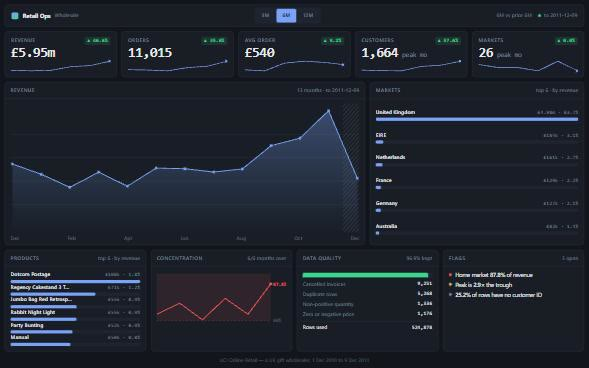</a>
 Self-initiated · <a href="https://aufanhakim1920-source.github.io/studio/work/dash-board/">open it ↗</a>

<b>TAKE 05</b> &nbsp;·&nbsp; <b>THROWN</b> &nbsp; a ceramics shop — filter, sort, pick a glaze

 
<a href="https://aufanhakim1920-source.github.io/studio/work/thrown/">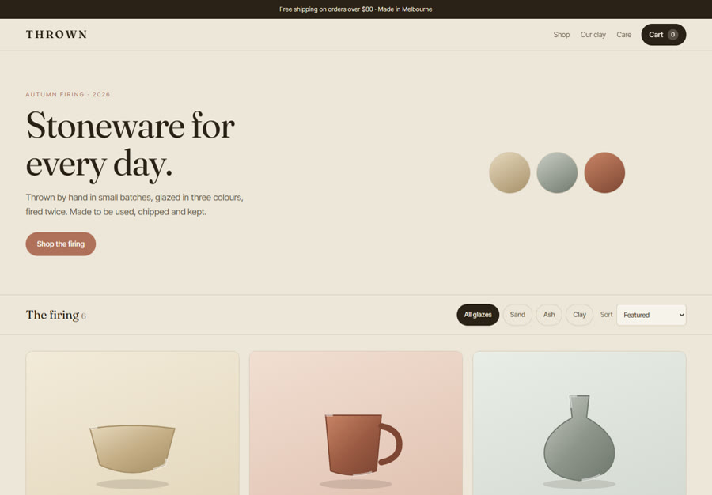</a>
 Self-initiated · <a href="https://aufanhakim1920-source.github.io/studio/work/thrown/">open it ↗</a>

<b>TAKE 06</b> &nbsp;·&nbsp; <b>Shelf</b> &nbsp; projects as book spines you pull off a shelf

 
<a href="https://aufanhakim1920-source.github.io/studio/work/shelf/">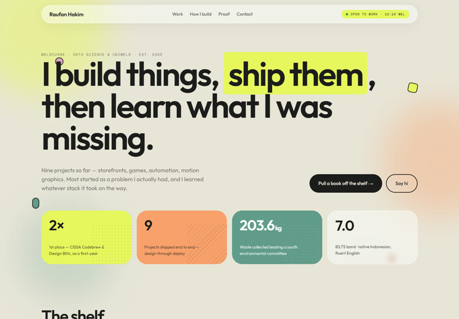</a>
 Self-initiated · <a href="https://aufanhakim1920-source.github.io/studio/work/shelf/">open it ↗</a>

<b>TAKE 07</b> &nbsp;·&nbsp; <b>AH-19</b> &nbsp; a bench console — one dial drives five readouts

 
<a href="https://aufanhakim1920-source.github.io/studio/work/ah19/">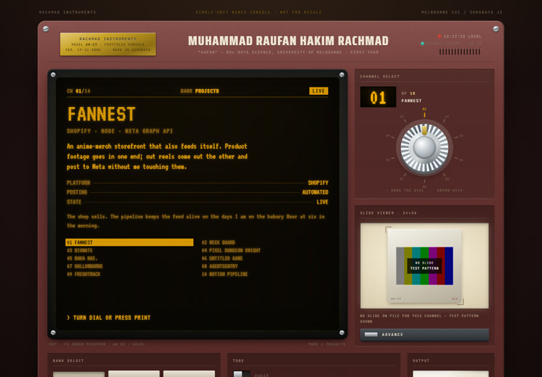</a>
 Self-initiated · <a href="https://aufanhakim1920-source.github.io/studio/work/ah19/">open it ↗</a>

<b>ROLL</b> &nbsp;·&nbsp; <b>the films</b> &nbsp; short motion films, made in code

 

<a href="https://aufanhakim1920-source.github.io/studio/work/motion-night/">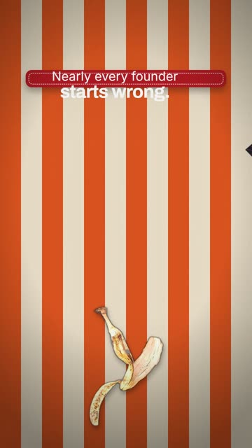 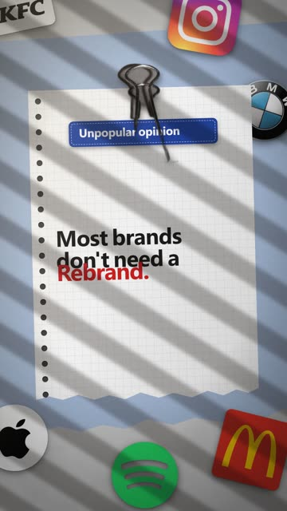 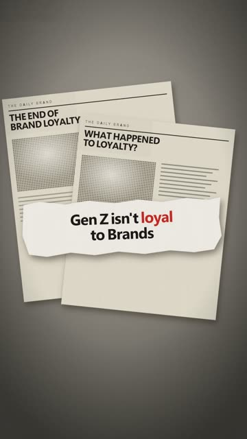 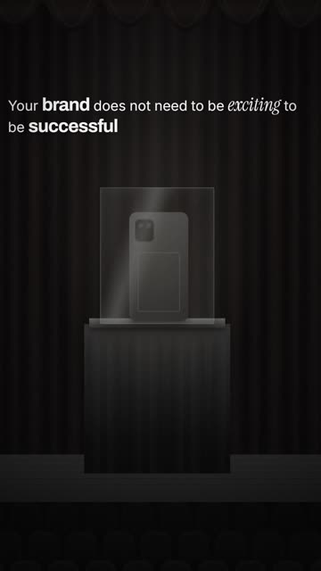 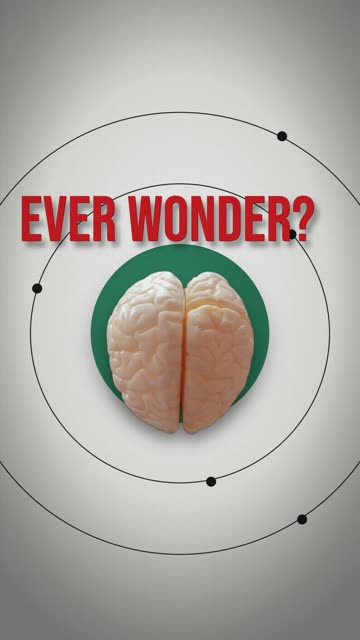 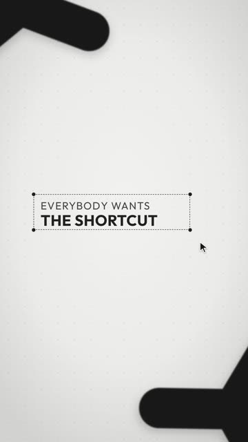 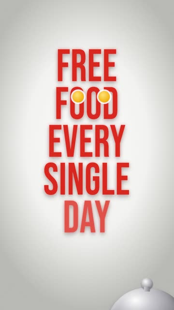</a>

<a href="https://aufanhakim1920-source.github.io/studio/work/motion-night/">Motion Night ↗</a> · <a href="https://www.instagram.com/aufanstudio/">Instagram</a> · <a href="https://www.youtube.com/@aufanstudio">YouTube</a>

 

<a href="https://aufanhakim1920-source.github.io/studio/">all 52 takes ↗</a> &nbsp;·&nbsp; <a href="https://aufanhakim1920-source.github.io/studio/work/portfolio/">hire me ↗</a> &nbsp;·&nbsp; <a href="mailto:aufanhakim1920@gmail.com">aufanhakim1920@gmail.com</a>

