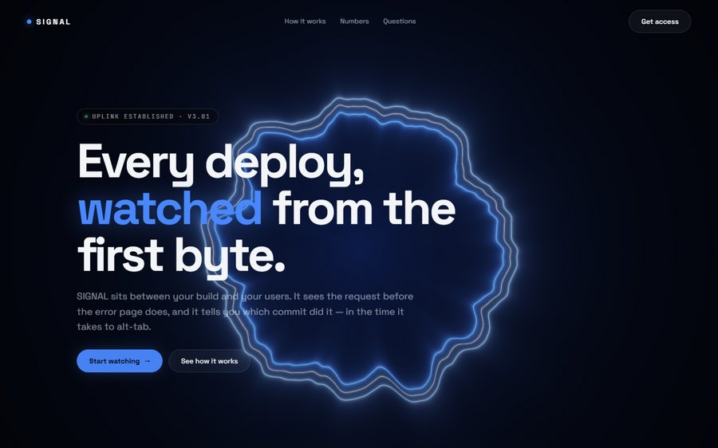
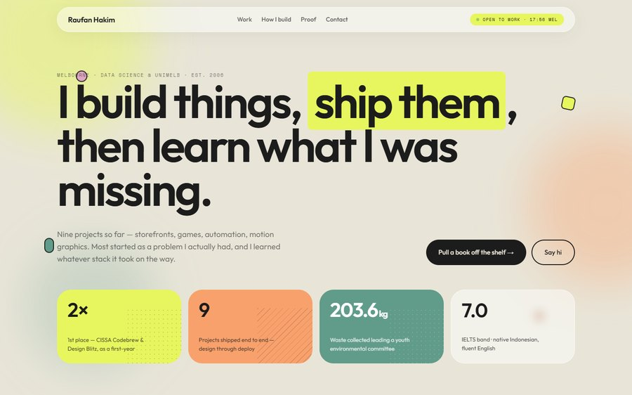
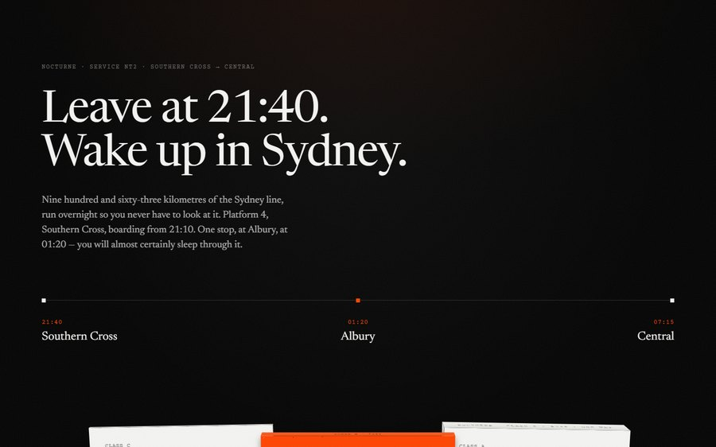
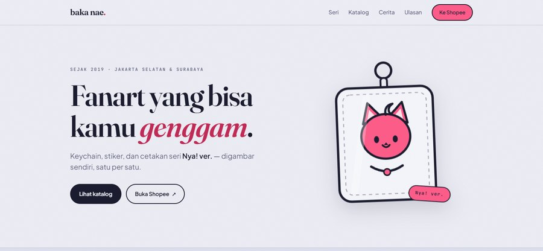
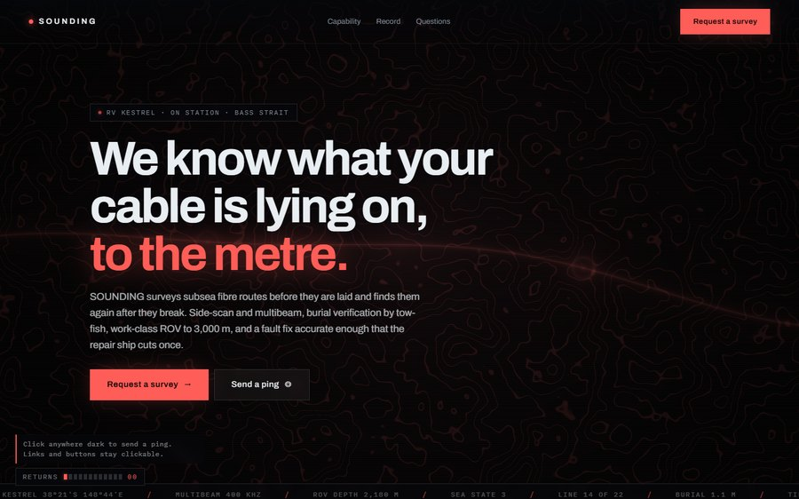
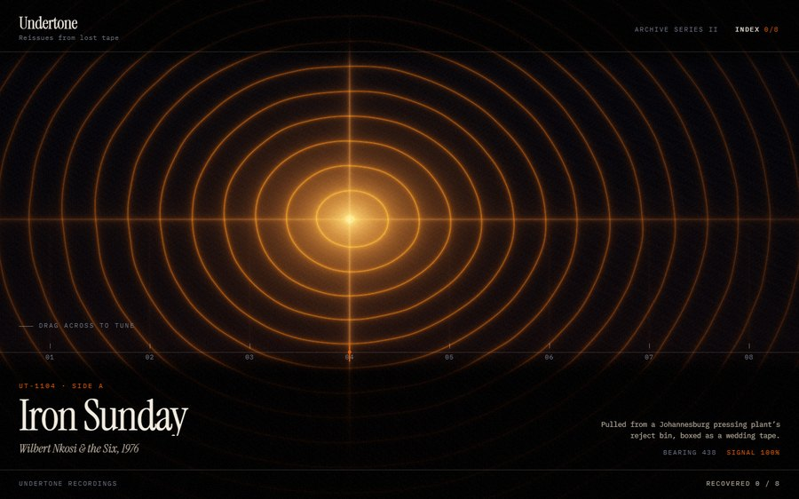
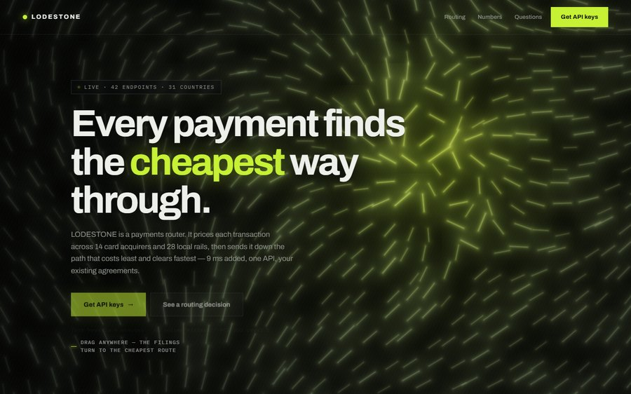

Every project is a take. ★ marks my favourites — open one.

<b>TAKE 01</b> &nbsp;·&nbsp; <b>SIGNAL</b> ★ &nbsp; a ribbon of light in raw WebGL — one shader, no library

 

 Self-initiated · it leans toward your cursor · <a href="https://aufanhakim1920-source.github.io/studio/work/land-aurora/">open it ↗</a>

<b>TAKE 02</b> &nbsp;·&nbsp; <b>Shelf</b> ★ &nbsp; projects as book spines you pull off a shelf

 

 Self-initiated · my first favourite, still · <a href="https://aufanhakim1920-source.github.io/studio/work/shelf/">open it ↗</a>

<b>TAKE 03</b> &nbsp;·&nbsp; <b>Nocturne</b> ★ &nbsp; a sleeper train — card thickness is the price

 

 Self-initiated · the price IS the thickness of the card you pick up · <a href="https://aufanhakim1920-source.github.io/studio/work/nocturne/">open it ↗</a>

<b>TAKE 04</b> &nbsp;·&nbsp; <b>baka nae.</b> ★ &nbsp; a brand site for my sister's art label

 

 The approved design — periwinkle and hot pink · for family, unpaid — the shop is hers · <a href="https://aufanhakim1920-source.github.io/studio/work/bakanae-atelier/">open it ↗</a>

<b>TAKE 05</b> &nbsp;·&nbsp; <b>ABYSSAL</b> ★ &nbsp; water seen from underneath

 

 Self-initiated · it stills where you hold the cursor · <a href="https://aufanhakim1920-source.github.io/studio/work/land-caustic/">open it ↗</a>

<b>TAKE 06</b> &nbsp;·&nbsp; <b>SOUNDING</b> ★ &nbsp; a subsea cable survey

 

 Self-initiated · fire a sonar ping into the dark and it charts the seabed it passes · <a href="https://aufanhakim1920-source.github.io/studio/work/land-sounding/">open it ↗</a>

<b>TAKE 07</b> &nbsp;·&nbsp; <b>UNDERTONE</b> ★ &nbsp; a reissue label

 

 Self-initiated · sweep a bearing across the dark until a lost side names itself · <a href="https://aufanhakim1920-source.github.io/studio/work/land-undertone/">open it ↗</a>

<b>TAKE 08</b> &nbsp;·&nbsp; <b>LODESTONE</b> ★ &nbsp; a payments router

 

 Self-initiated · drag the magnet and a field of iron filings turns to the cheapest route · <a href="https://aufanhakim1920-source.github.io/studio/work/land-lodestone/">open it ↗</a>

<b>TAKE 09</b> &nbsp;·&nbsp; <b>Week Board</b> &nbsp;<code>LIVE</code>&nbsp; a booking page that reads my real calendar

 

 Netlify · Google Calendar · <a href="https://stellular-queijadas-097900.netlify.app">open it ↗</a>

<b>TAKE 10</b> &nbsp;·&nbsp; <b>Biomate</b> &nbsp;<code>LIVE</code>&nbsp; swipe a hike, join the group, record the walk

 

 Hackathon, uni team · Postgres with row-level security · <a href="https://aufanhakim1920-source.github.io/biomate/">open it ↗</a> · <a href="https://github.com/aufanhakim1920-source/biomate">code</a>

<b>ROLL</b> &nbsp;·&nbsp; <b>the films</b> &nbsp; short motion films, made in code

 

<a href="https://aufanhakim1920-source.github.io/studio/work/motion-night/">Motion Night ↗</a> · <a href="https://www.instagram.com/aufanstudio/">Instagram</a> · <a href="https://www.youtube.com/@aufanstudio">YouTube</a>

 

<a href="https://aufanhakim1920-source.github.io/studio/">all 52 takes ↗</a> &nbsp;·&nbsp; <a href="https://aufanhakim1920-source.github.io/studio/work/portfolio/">hire me ↗</a> &nbsp;·&nbsp; <a href="mailto:aufanhakim1920@gmail.com">aufanhakim1920@gmail.com</a>

