

<b>Aufan Rachmad</b> &mdash; a designer who builds. Websites, interactive UI and short motion films, all written in code, no templates. Melbourne.

<a href="https://aufanhakim1920-source.github.io/studio/">all 52 takes ↗</a> &nbsp;·&nbsp; <a href="https://aufanhakim1920-source.github.io/studio/work/motion-night/">the films ↗</a> &nbsp;·&nbsp; <a href="https://aufanhakim1920-source.github.io/studio/work/portfolio/">hire me ↗</a> &nbsp;·&nbsp; <a href="https://www.instagram.com/aufanstudio/">@aufanstudio</a> &nbsp;·&nbsp; <a href="mailto:aufanhakim1920@gmail.com">email</a>

 

<h3 align="center">★ &nbsp;the favourites</h3>

Seven I keep. Every one is live &mdash; click it and use it.

<a href="https://aufanhakim1920-source.github.io/studio/work/shelf/">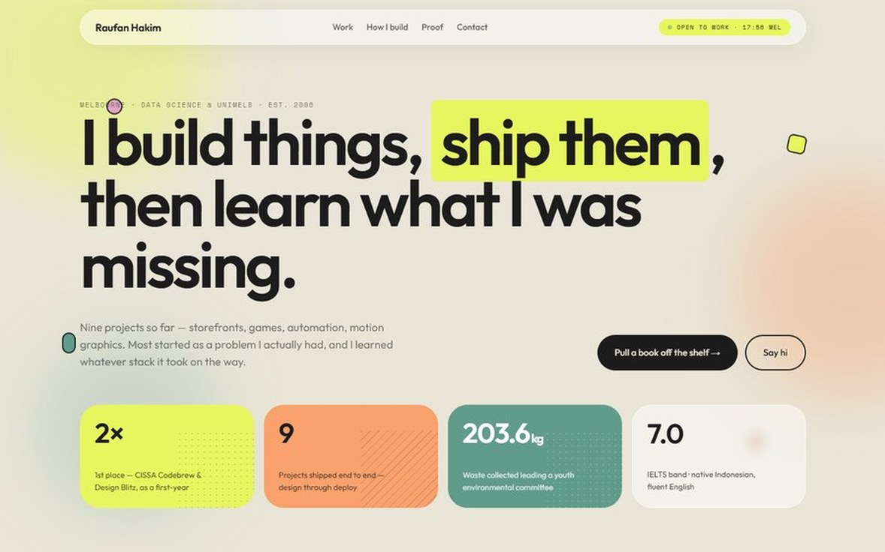</a>

<b>Shelf</b> projects as book spines you pull off a shelf

<a href="https://aufanhakim1920-source.github.io/studio/work/nocturne/">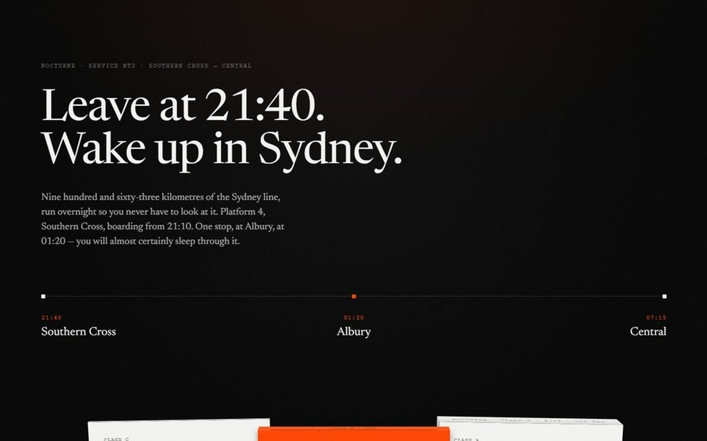</a> <a href="https://aufanhakim1920-source.github.io/studio/work/bakanae-atelier/">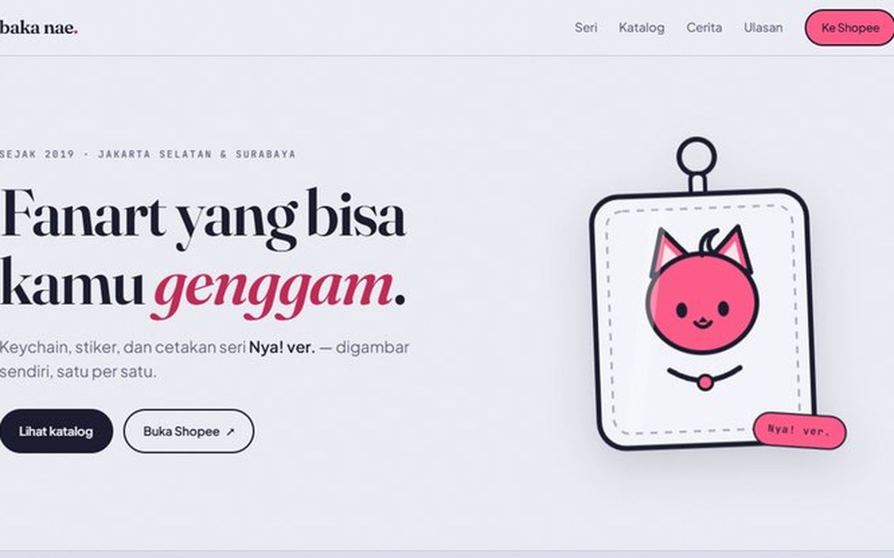</a>

<b>Nocturne</b> sleeper train — card thickness is the price &nbsp;·&nbsp; <b>baka nae. — atelier</b> the approved design — periwinkle and hot pink; 40-42 are this in her palettes

<a href="https://aufanhakim1920-source.github.io/studio/work/land-aurora/">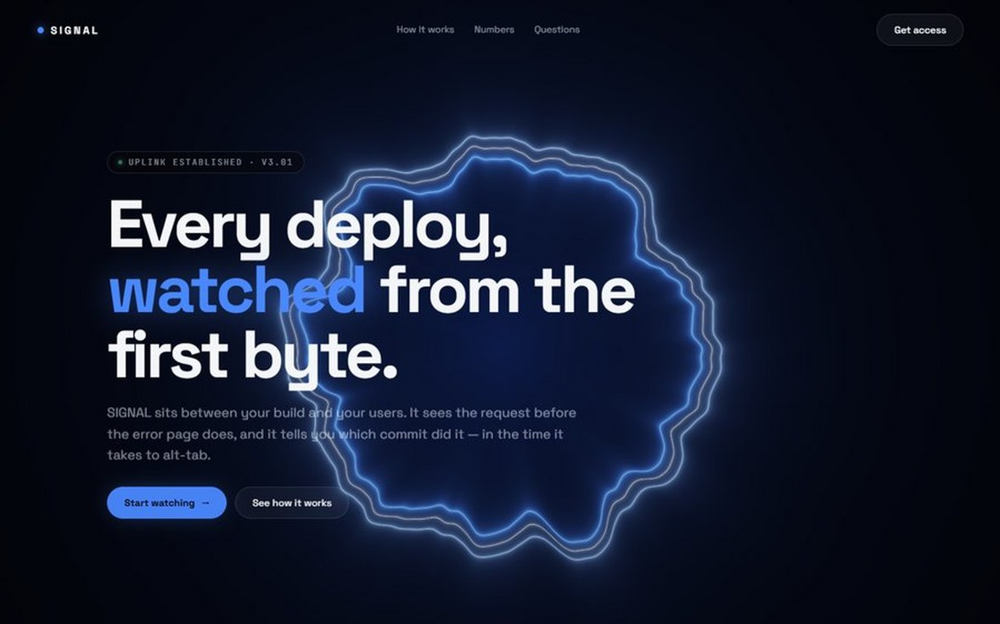</a> <a href="https://aufanhakim1920-source.github.io/studio/work/land-caustic/">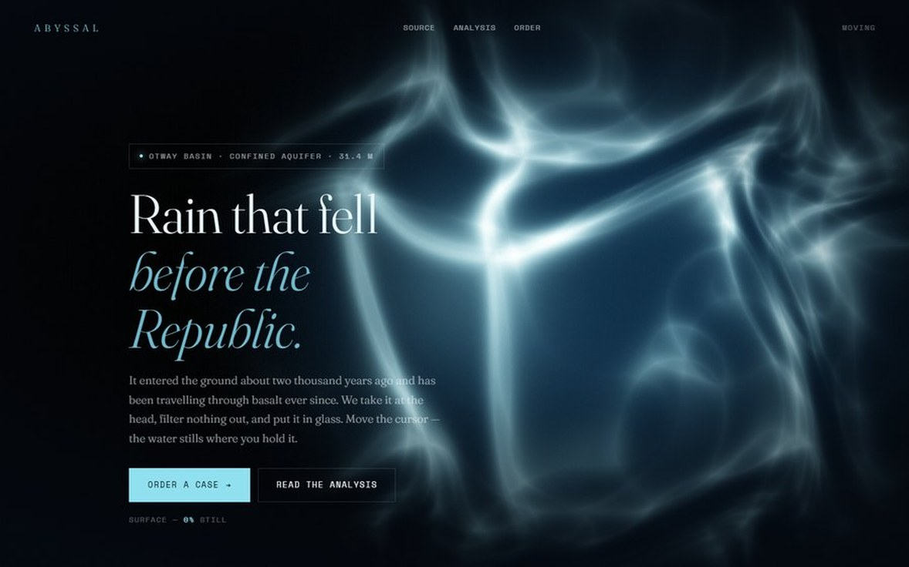</a>

<b>SIGNAL</b> a ribbon of light in raw WebGL — one shader, no library, and it leans toward your cursor &nbsp;·&nbsp; <b>ABYSSAL</b> water seen from underneath — it stills where you hold the cursor

 

<b>SOUNDING</b> subsea cable survey — fire a sonar ping into the dark and it charts the seabed it passes &nbsp;·&nbsp; <b>UNDERTONE</b> a reissue label — sweep a bearing across the dark until a lost side names itself

 

<h3 align="center">the latest takes</h3>

Newest first. Retired numbers are never reused.

<a href="https://aufanhakim1920-source.github.io/studio/work/land-diorama/">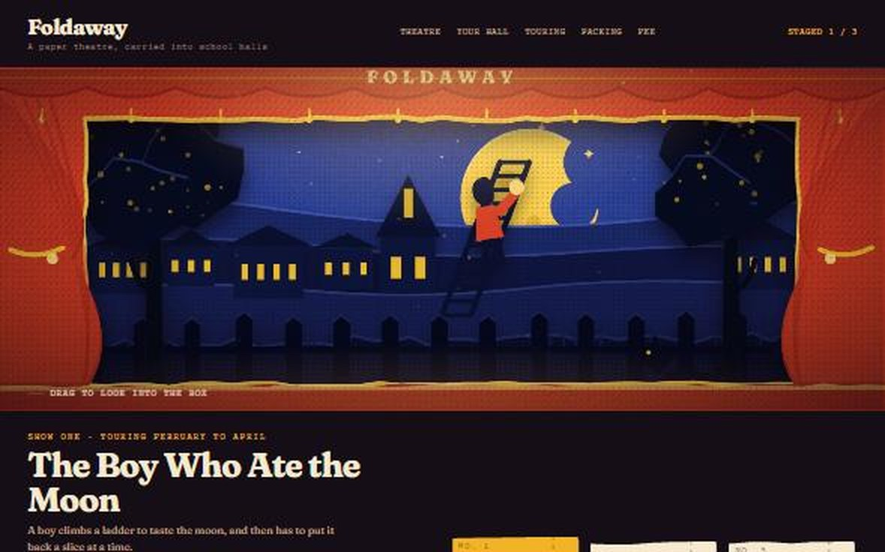</a> <a href="https://aufanhakim1920-source.github.io/studio/work/land-roast/">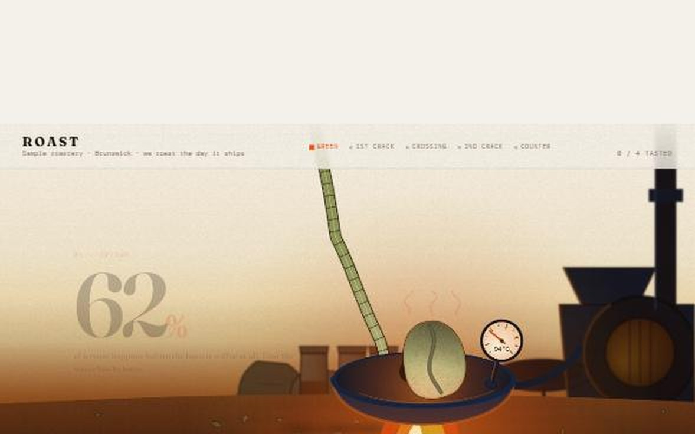</a> <a href="https://aufanhakim1920-source.github.io/studio/work/land-container/">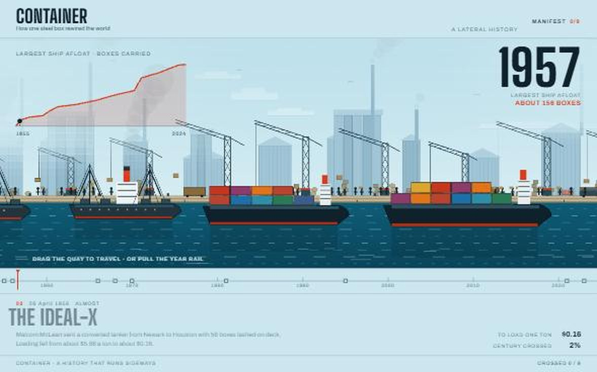</a>

<b>FOLDAWAY</b> a paper toy theatre you look into — cut-paper flats in real 3D, and the show re-scenes &nbsp;·&nbsp; <b>ROAST</b> a painted coffee bean you roast yourself — it pops at first crack and the flavour follows &nbsp;·&nbsp; <b>CONTAINER</b> a history that runs sideways — travel right through the century and the port grows around you

<a href="https://aufanhakim1920-source.github.io/studio/work/land-chroma/">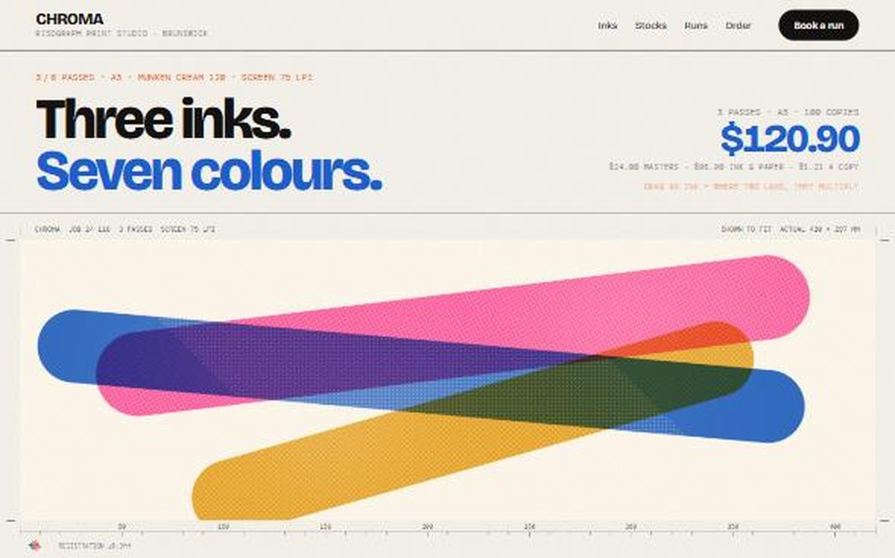</a> <a href="https://aufanhakim1920-source.github.io/studio/work/land-longexposure/">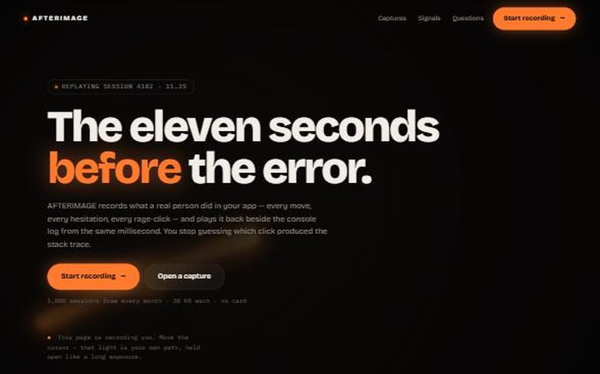</a> <a href="https://aufanhakim1920-source.github.io/studio/work/dash-chairs/">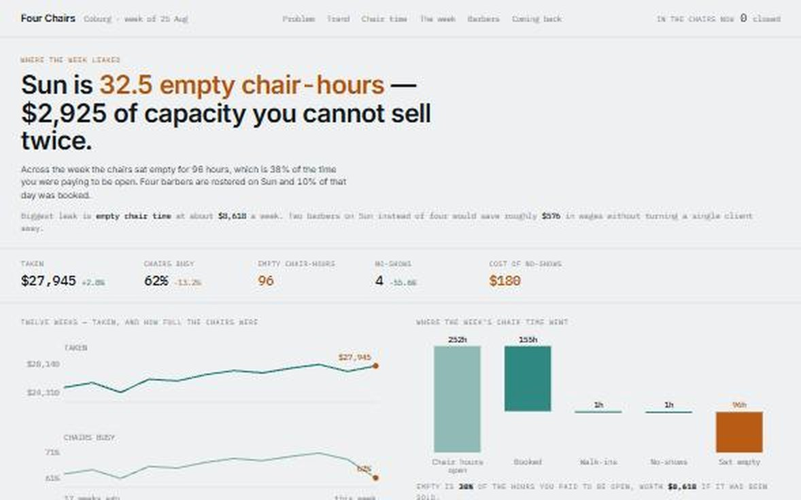</a>

<b>CHROMA</b> a risograph studio — drag the inks over each other, and the passes are the price &nbsp;·&nbsp; <b>AFTERIMAGE</b> session replay — the page light-paints your own cursor, because recording you is the product &nbsp;·&nbsp; <b>Four Chairs</b> a barbershop — empty chair time, no-shows, or clients not returning: which one is the leak

 

<h3 align="center">roll &nbsp;·&nbsp; the films</h3>

Short motion films, made in code &mdash; narrated in my own voice.

<a href="https://aufanhakim1920-source.github.io/studio/work/motion-night/">Motion Night ↗</a> &nbsp;·&nbsp; <a href="https://www.instagram.com/aufanstudio/">Instagram</a> &nbsp;·&nbsp; <a href="https://www.youtube.com/@aufanstudio">YouTube</a>

 

<h3 align="center">live systems</h3>

<a href="https://stellular-queijadas-097900.netlify.app">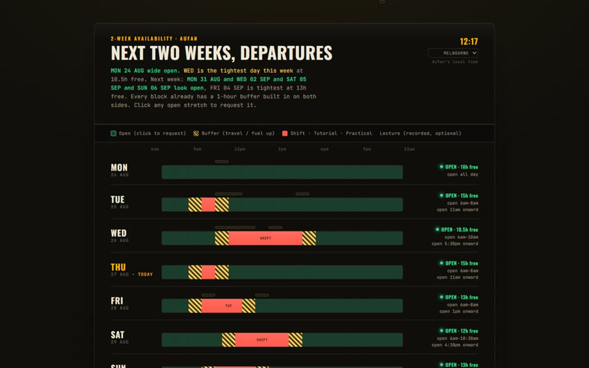</a> <a href="https://aufanhakim1920-source.github.io/biomate/">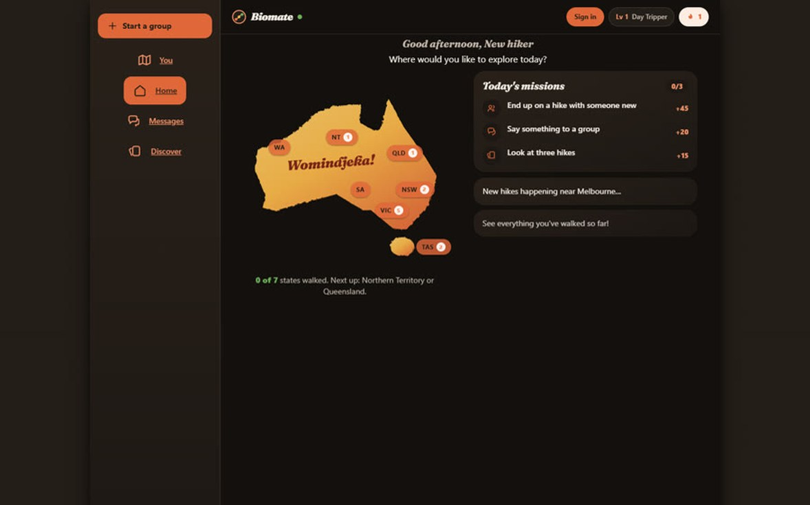</a>

<b>Week Board</b> a booking page that reads my real calendar &nbsp;·&nbsp; <b>Biomate</b> swipe a hike, join the group, record the walk with real GPS &nbsp;·&nbsp; <a href="https://github.com/aufanhakim1920-source/biomate">code</a>

Every project is a take.

